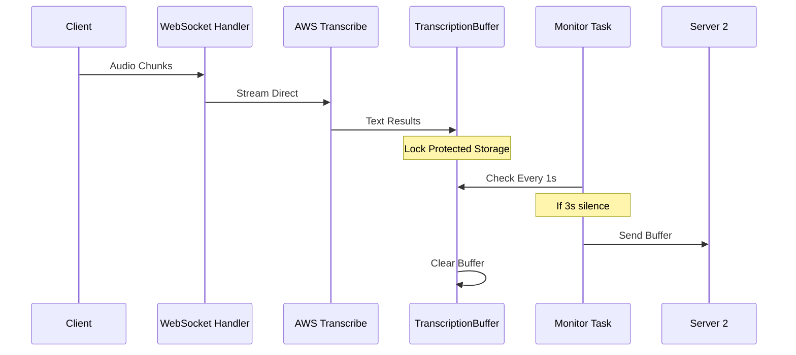

# Analiza Detaliată a Fluxului de Date

## 1. Primirea Datelor de la Client

### Intrare Audio (handle_websocket)
```python
async def handle_websocket(websocket):
    stream_handler = AudioStreamHandler()
    async for message in websocket:
        if isinstance(message, bytes):
            await stream_handler.process_audio_data(message)
```
- Datele audio brute sosesc prin WebSocket în chunks
- Fiecare chunk este trimis direct către AudioStreamHandler
- NU sunt salvate în niciun buffer intermediar

## 2. Procesarea Audio prin AWS Transcribe

### Trimitere către AWS (AudioStreamHandler)
```python
async def process_audio_data(self, data):
    if not self.stream:
        await self.initialize_transcribe()
    await self.stream.input_stream.send_audio_event(audio_chunk=data)
```
- Chunk-urile audio merg direct la AWS Transcribe
- Se folosește streaming în timp real
- Nu există buffer intermediar pentru audio

## 3. Primirea Transcrierii

### Handler pentru Evenimente (MyEventHandler)
```python
async def handle_transcript_event(self, transcript_event: TranscriptEvent):
    results = transcript_event.transcript.results
    for result in results:
        for alt in result.alternatives:
            transcription_buffer.add_item(alt.transcript)
```
- AWS Transcribe trimite rezultate text
- AICI începe primul buffer: TranscriptionBuffer
- Textul este stocat cu timestamp

## 4. Gestionarea Buffer-ului de Transcriere

### Buffer Thread-Safe (TranscriptionBuffer)
```python
def add_item(self, text: str):
    with self.lock:
        self.items.append({
            'text': text,
            'timestamp': datetime.now().strftime('%H:%M:%S.%f')[:-3]
        })
        self.last_addition_time = time.time()
```
- Buffer protejat cu threading.Lock
- Stochează text și timestamp
- Urmărește timpul ultimei adăugări

## 5. Monitorizarea și Procesarea Buffer-ului

### Thread Separat de Monitorizare
```python
async def monitor_transcriptions(websocket):
    while True:
        items = transcription_buffer.get_items()
        if items and transcription_buffer.time_since_last_addition() >= 3:
            await send_to_receiver(items, websocket)
            transcription_buffer.clear_items()
        await asyncio.sleep(1)
```
- Rulează într-un task asyncio separat
- Verifică buffer-ul la fiecare secundă
- Procesează când:
  * Există items în buffer
  * Au trecut 3 secunde de la ultima adăugare

## 6. Thread-uri și Taskuri

### Thread-uri Active:
1. **Main Thread**:
   - Rulează event loop-ul asyncio principal
   - Gestionează WebSocket server

2. **Asyncio Tasks**:
   - `monitor_transcriptions`: Monitorizează buffer-ul
   - `handle_events`: Procesează evenimente AWS Transcribe
   - `handle_websocket`: Gestionează conexiunea cu clientul

### Sincronizare:
- TranscriptionBuffer folosește `threading.Lock`
- Operațiile async folosesc `await`
- Nu există blocaje între thread-uri

## 7. Flux Complet al Datelor



## 8. Caracteristici Cheie

1. **Zero Buffer pentru Audio**:
   - Audio merge direct la AWS
   - Nu se acumulează în memorie

2. **Buffer doar pentru Text**:
   - Thread-safe
   - Cu timestamps
   - Monitorizat continuu

3. **Procesare Asincronă**:
   - Non-blocking
   - Eficientă
   - Real-time

4. **Managementul Resurselor**:
   - Buffer-ul este golit după procesare
   - Conexiunile sunt închise corect
   - Memoria este gestionată eficient