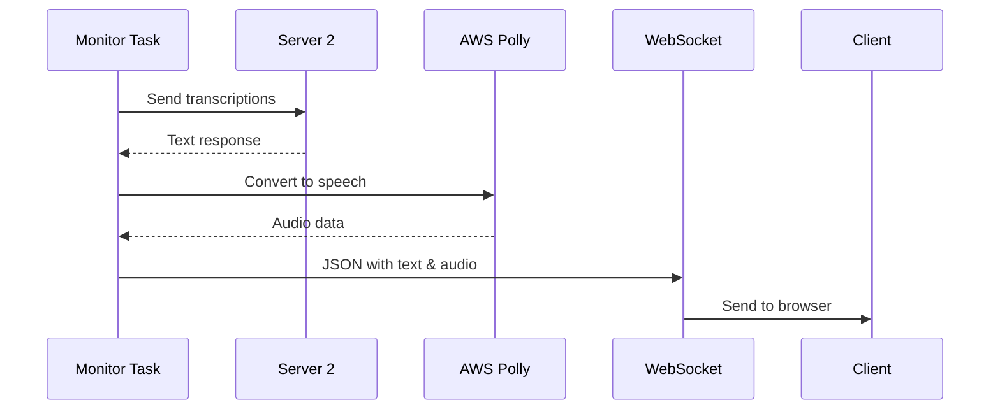

# Procesarea Răspunsului și Conversia Text-to-Speech

## 1. Trimitere la Server 2 și Primire Răspuns

```python
async def send_to_receiver(transcriptions, websocket):
    try:
        # Conexiune la server 2
        client_socket = socket.socket(socket.AF_INET, socket.SOCK_STREAM)
        client_socket.connect((RECEIVER_HOST, RECEIVER_PORT))
        
        # Trimite transcripțiile
        data = pickle.dumps(transcriptions)
        client_socket.send(size.to_bytes(8, 'big'))
        client_socket.sendall(data)
        
        # Primește răspunsul
        response_data = # ... primire date ...
        response = pickle.loads(response_data)
```
- Rulează pe același task asyncio ca `monitor_transcriptions`
- Operație blocantă transformată în asincronă prin asyncio

## 2. Conversia Text-to-Speech

### Funcția de Conversie
```python
async def text_to_speech(text):
    try:
        polly_client = boto3.client('polly', region_name=REGION)
        response = polly_client.synthesize_speech(
            Text=text,
            OutputFormat='mp3',
            VoiceId='Joanna'
        )
        
        if "AudioStream" in response:
            audio_data = response['AudioStream'].read()
            return base64.b64encode(audio_data).decode('utf-8')
```

### Locație și Thread
- Apelată din `send_to_receiver`
- Rulează tot pe task-ul de monitorizare
- Operație blocantă AWS Polly transformată în asincronă

## 3. Flow-ul Complet al Răspunsului



## 4. Structura Thread-urilor și Tasks

### Monitor Task
1. Detectează 3 secunde de liniște
2. Trimite date la Server 2
3. Primește răspuns text
4. Apelează AWS Polly
5. Trimite rezultatul la client

### Ordinea Operațiilor
```python
# În monitor_transcriptions task:
if items and transcription_buffer.time_since_last_addition() >= 3:
    # 1. Trimite la Server 2
    await send_to_receiver(items, websocket)
    
    # În send_to_receiver:
    response = pickle.loads(response_data)
    # 2. Convertește la audio
    audio_base64 = await text_to_speech(response)
    # 3. Trimite la client
    await websocket.send(json.dumps({
        'type': 'server_response',
        'message': response,
        'audio': audio_base64
    }))
```

## 5. Format Date

### Request către Server 2
```python
{
    'text': 'transcribed text',
    'timestamp': '14:30:45.123'
}
```

### Răspuns către Client
```json
{
    "type": "server_response",
    "message": "Response to: transcribed text",
    "audio": "base64_encoded_audio_data"
}
```

## 6. Caracteristici Importante

1. **Single Task Processing**:
   - Totul rulează pe același task asyncio
   - Operațiile blocante sunt gestionate asincron
   - Nu necesită sincronizare adițională

2. **Efficient Memory Management**:
   - Audio data este encoded în base64 o singură dată
   - Nu se păstrează copii intermediare

3. **Error Handling**:
   - Erori AWS Polly gestionate
   - Erori de conexiune cu Server 2 gestionate
   - Erori WebSocket gestionate

4. **Asynchronous Flow**:
   - Toate operațiile sunt non-blocking
   - Folosește await pentru operații asincrone
   - Menține responsivitatea serverului

## 7. Optimizări

1. **Network Efficiency**:
   - O singură conexiune la Server 2 per request
   - Un singur call la AWS Polly
   - O singură transmisie WebSocket

2. **Resource Management**:
   - Conexiunile sunt închise corect
   - Memoria este eliberată prompt
   - Nu există memory leaks