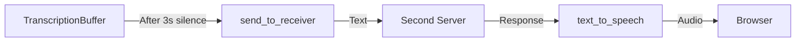

# Audio Transcription Server Documentation

## Overview
The server is a real-time audio processing system that handles speech-to-text and text-to-speech conversions using AWS services. It acts as a bridge between a web client, AWS services, and a secondary processing server.

## Architecture Components

### 1. Server Configuration
```python
WEBSOCKET_PORT = 8765  # Browser connection
RECEIVER_PORT = 5001   # Second server connection
SAMPLE_RATE = 16000    # Audio configuration
REGION = "eu-west-1"   # AWS region
```

### 2. Key Classes

#### TranscriptionBuffer
- Thread-safe buffer for storing transcribed text
- Maintains timestamps for each transcription
- Tracks last addition time for batch processing
- Methods:
  * `add_item`: Adds new transcription with timestamp
  * `get_items`: Retrieves all stored items
  * `clear_items`: Empties the buffer
  * `time_since_last_addition`: Tracks silence periods

#### AudioStreamHandler
- Manages AWS Transcribe streaming
- Initializes and maintains the transcription stream
- Methods:
  * `initialize_transcribe`: Sets up AWS Transcribe client
  * `process_audio_data`: Sends audio chunks to AWS
  * `close`: Cleanup resources

#### MyEventHandler
- Handles incoming transcription events from AWS
- Stores results in TranscriptionBuffer

## Data Flow

### 1. Audio Input Flow


### 2. Processing Flow


## Key Processes

### 1. WebSocket Connection (handle_websocket)
- Accepts client connections on port 8765
- Creates AudioStreamHandler instance
- Starts monitoring task
- Processes incoming audio data

### 2. Transcription Monitoring (monitor_transcriptions)
- Runs in separate task
- Checks buffer every second
- Triggers processing when:
  * Buffer contains items
  * No new items for 3 seconds

### 3. Server Communication (send_to_receiver)
1. Connects to second server on port 5001
2. Sends serialized transcriptions
3. Receives text response
4. Converts response to speech using AWS Polly
5. Sends text and audio to browser

### 4. Text-to-Speech Process
```python
async def text_to_speech(text):
    # Uses AWS Polly
    # Converts text to MP3
    # Returns base64 encoded audio
```

## Error Handling
- WebSocket connection errors
- AWS service errors
- Second server communication errors
- Thread-safe operations with locks

## Threading Model
- Main loop: Asyncio event loop
- WebSocket handling: Async/await
- Transcription buffer: Thread-safe with locks
- Monitoring: Separate asyncio task

## Data Format
1. Input: Raw audio bytes (16kHz, mono, PCM)
2. Internal: Text with timestamps
3. Output: JSON with format:
```json
{
    "type": "server_response",
    "message": "text response",
    "audio": "base64 encoded mp3"
}
```

## Security Considerations
- AWS region configuration
- Error handling and logging
- Thread-safe operations
- Connection cleanup
- Resource management

## Dependencies
- websockets: WebSocket server
- boto3: AWS services
- amazon-transcribe: Real-time transcription
- asyncio: Async operations
- threading: Thread safety